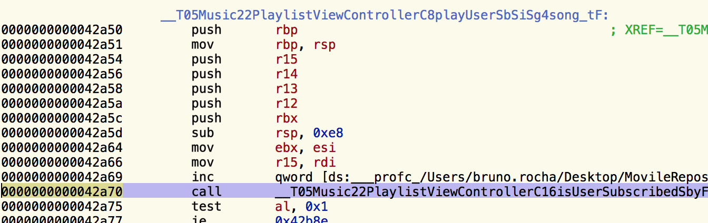

# @inline
> **@inline**: isn't officially supported!

Compiler automatically optimizes code. It uses as `@inline(_always)` when a function is called from one or several places in project. On the other hand, it uses as `@inline(never)` when function is called from multiple places to reduce binary file size and increase performance.

`@inline(__always)`: compiler always inlines the method, **if possible**.
```swift
func calculateAndPrintSomething() {
   var num = 1
   num *= 10
   num /= 5
   print("My number: \(num)")
}
// Binary file where calculateAndPrintSomething() is called.
print("I'm going to do print some number")
calculateAndPrintSomething()
print("Done!")
```
`@inline(never)`: compiler never inlines the method.
```swift
@inline func calculateAndPrintSomething() {
    var num = 1
    num *= 10
    num /= 5
    print("My number: \(num)")
}
// Binary file where calculateAndPrintSomething() is called.
print("I'm going to do print some number")
var num = 1
num *= 10
num /= 5
print("My number: \(num)")
print("Done!")
```
## **Usage Scenario**

Let's pretend we have a music player in our app and some actions are premium-only. The `isUserSubscribed(_:)` method validates the user subscription and returns a boolean stating if the user is subscribed or not:
```swift
func isUserSubscribed() -> Bool {
   //Some very complex validation
   return true
}
func play(song: Song) {
if isUserSubscribed() {
       //Play the song
   } else {
       //Ask user to subscribe
   }
}
```
This works great for our code, but look what happens if I disassemble this app and search for the `play(_:)` method's assembly:


Now look what happens when `@inline(__always)` is applied to `isUserSubscribed(_:)`:

The same `play(_:)` method's assembly doesn't have reference to a subscription! The method call replaced by the "complex validation", making the assembly look more cryptic and the subscription significantly harder to be cracked.

As a bonus, since every call to `isUserSubscribed(_:)` got replaced by the validation, there is no single way to unlock the app's entire subscription - a hacker would now have to crack every single method that does the validation. Of course, this also means that our binary got larger as we now have duplicated code everywhere.

Be aware that using `@inline(__always)` doesn't guarantee that the compiler will actually inline your method. The rules for it are unknown, and there are some cases where inlining is impossible, such as when dynamic dispatching can't be avoided.
