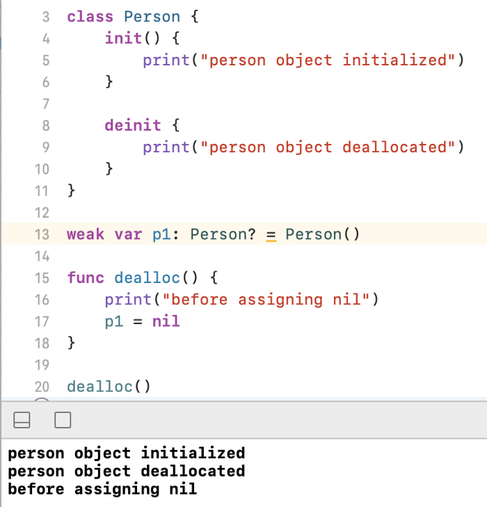

- `weak` doesn't keep reference, it keeps child so that if parent is deallocated from memory, weak variable will be nil automatically. [Example]()
- `unowned` is basically `weak!` use `unowned` If you are sure parent won't be deallocated during childs lifecycle. [Example]()
- `struct` can't be referenced. Therefore, you can't use `weak` or `unowned` for `struct`.
- If a `class` passed into a function without using `weak` or `unowned`, this function will keep a strong reference of this class and will release it as soon as execution is completed. [Example]()
- If a `class` passed into a function by using `weak`, function will break during execution(return nil), if parent reference is deallocated from memory.[Example]()
- Computed properties behaves as functions.
- If functions(closures) are stored in a property, they will keep strong references inside them and this may cause retain cycles, if `weak` and `unowned` not used. [Example]()
- Property observers aren’t called when ARC sets a weak reference to nil.
-------
> Image below gives an opinion on how weak variables behave. Object will be allocated and deallocated immediately, because there is no strong reference to keep that object in the memory.
> 

- ##### Solution for *retain cycles* caused by passing a reference of `class` in a *stored property*, without using `weak` and `unowned`.

  ```swift
  // WRONG WAY! X
  class Person {
      var bag: Bag?
      var age: Int
      init(bag: Bag?, age: Int = 15) { self.age = age; self.bag = bag; print("Person init") }
      deinit { print("Person deinit") } // called if there is 0 reference count.
  }

  class Bag {
      var person: Person?
      var count: Int
      init(person: Person?, count: Int = 5) { self.person = person; self.count = count; print("Bag init") }
      deinit { print("Bag deinit") } // called if there is 0 reference count.
  }

  var person1 = Person(bag: Bag())
  // Bag init - Bag() Reference count: 1 (person1.bag)
  // Person init - Person() Reference count: 1 (person1)
  person3.bag = nil // Bag deinit - Bag() Reference count: 0

  var person2: Person? = Person() // Person init - Person() Reference count: 1 (person2)
  var bag2: Bag? = Bag() // Bag init - Bag() Reference count: 1 (bag2)
  person2.bag = bag2 // Bag() Reference count: 2 (bag2, person2.bag)
  bag2 = nil // Bag() Reference count: 1 (person2.bag)
  person2 = nil // Person deinit - Person() Reference count: 0 // Bag deinit - Bag() Reference count: 0

  var person3: Person? = Person() // Person init - Person() Reference count: 1 (person3)
  var bag3: Bag? = Bag() // Bag init - Bag() Reference count: 1 (bag3)
  person3.bag = bag3 // Bag() Reference count: 2 (bag3, person3.bag)
  bag3.person = person3 // Person() Reference count: 2 (person3, bag3.person)
  bag3 = nil // Bag() Reference count: 1 (person3.bag)
  person3 = nil // Person() Reference count: 1 (bag3.person)
  // now you are unable to reach these references due to bag3 and person3 is nil. Instead you should have done like below or use weak/unowned

  var person4: Person? = Person() // Person init - Person() Reference count: 1 (person4)
  var bag4: Bag? = Bag() // Bag init - Bag() Reference count: 1 (bag4)
  person4.bag = bag4 // Bag() Reference count: 2 (bag4, person4.bag)
  bag4.person = person4 // Person() Reference count: 2 (person4, bag4.person)
  bag4.person = nil // Person() Reference count: 1 (person4)
  person4.bag = nil // Bag() Reference count: 1 (bag4)
  bag4 = nil // Bag deinit - Bag() Reference count: 0
  person4 = nil // Person deinit - Person() Reference count: 0
  ```

- ##### Solution for *retain cycles* caused by passing a reference of `class` in a *stored property*, by using `weak`.

  ```swift
  // BEST PRACTICE ✓
  class Person {
      weak var bag: Bag? // bu property buna kopyalanan property memory'de olduğu sürece olur, childi gibi düşünebilirsin
      var age: Int
      init(bag: Bag?, age: Int = 15) { self.age = age; self.bag = bag; print("Person init") }
      deinit { print("Person deinit") } // called if there is 0 reference count.
  }

  class Bag {
      weak var person: Person? // This is a child property, if parent deallocated from memory, automatically child will too. It isn't a reference so It doesn't increase reference count.
      var count: Int
      init(person: Person?, count: Int = 5) { self.person = person; self.count = count; print("Bag init") }
      deinit { print("Bag deinit") } // called if there is 0 reference count.
  }

  weak var person1 = Person() // Parent(Person()) isn't allocated anywhere in memory, so person1 will suddently deallocated(person1 == nil).
  // Person init
  // Person deinit

  unowned var person2 = Person() // Parent(Person()) isn't allocated anywhere in memory, so person1 will suddently deallocated with an error(person2 != nil).
  // Person init
  // Person deinit

  var person3 = Person(bag: Bag()) // Parent(Bag()) isn't allocated anywhere in memory, so person3.bag will suddently deallocated
  // Bag init
  // Person init
  // Bag deinit

  var person4: Person? = Person() // Person init - Person() Reference count: 1 (person4)
  var bag4: Bag? = Bag() // Bag init - Bag() Reference count: 1 (bag4)
  person4!.bag = bag4 //  Bag() Reference count: 1 (bag4) - person4!.bag is child of bag4
  bag4!.person = person4 //  Person() Reference count: 1 (person4) - bag!.person4 is child of person4
  bag4 = nil // Bag deinit - Bag() Reference count: 0
  person!.bag == nil // true - Parent is denitiliazed so the child.
  ```

- ##### Solution for *retain cycles* caused by passing a reference of `class` in a *stored property*, by using `unowned`.

  ```swift
  // BEST PRACTICE ✓
  class Person {
      weak var bag: Bag? // This is a child reference of a Strong Reference so that doesn't increase reference count of its parent.
      var age: Int
      init(bag: Bag?, age: Int = 15) { self.age = age; self.bag = bag; print("Person init") }
      deinit { print("Person deinit") } // called if there is 0 reference count.
  }

  class Bag {
      unowned var person: Person // This is a child property, It isn't a reference so It doesn't increase reference count. We must be sure that parent of person will never be nil before bag.
      var count: Int
      init(person: Person?, count: Int = 5) { self.person = person; self.count = count; print("Bag init") }
      deinit { print("Bag deinit") } // called if there is 0 reference count.
  }

  var person1: Person? = Person() // Person init - Person() Reference count: 1 (person1)
  var bag1: Bag? = Bag() // Bag init - Bag() Reference count: 1 (bag1)
  person1!.bag = bag1 // Bag() Reference count: 1 (bag1) - person1!.bag is child of bag1
  bag1!.person = person1 // Person() Reference count: 1 (person1) - bag1!.person is child of person1
  person1 = nil // Person deinit - Person() Reference count: 0
  // Error: unowned bag1!.person cannot be nil!

  var person2: Person? = Person() // Person init - Person() Reference count: 1 (person1)
  var bag2: Bag? = Bag() // Bag init - Bag() Reference count: 1 (bag1)
  person2!.bag = bag2 // Bag() Reference count: 1 (bag1) - person1!.bag is child of bag1
  bag2!.person = person2 // Person() Reference count: 1 (person1) - bag1!.person is child of person1
  bag2 = nil // Bag deinit - Bag() Reference count: 0
  person2 = nil // Person deinit - Person() Reference count: 0
  ```

- ##### Solution for *retain cycles* caused by passing a reference of `class` or `self` in a *function(closure)* by using `weak`.

  ```swift
  // WRONG WAY! X
  class Blog {
      let name: String
      let url: URL
      var publishedPosts:[String] = [String]()
      init(name: String, url: URL) { self.name = name; self.url = url }
      func publish(post: String) {
          // Faking a networking request with this delay
          DispatchQueue.main.asyncAfter(deadline: .now() + 3) {
              self.puslishedPosts.append(post)
              print("Published post count is now: \(self.publishedPosts.count)")
          }
      }
      deinit { print("Blog deinit") }
  }

  var blog: Blog? = Blog(name: "Weak and Unowned", url: URL(string: "www.github.com"))
  blog?.publish(post: "Explaining weak and unowned self") // will be fired 3 seconds later
  blog = nil // fired now

  // Outputs: 3 seconds later
  // Published post count is now: 1
  // Blog deinit - DispatchQueue closure kept our self(Blog()) alive untill closure finishes (3 seconds).
  ```

  ```swift
  // BEST PRACTICE ✓
  class Blog {
      let name: String
      let url: URL
      var publishedPosts:[String] = []()
      init(name: String, url: URL) { self.name = name; self.url = url }
      func publish(post: String) {
          // Faking a networking request with this delay
          DispatchQueue.main.asyncAfter(deadline: .now() + 3) { [weak self] // we cannot use unowned here, because we know Blog() may be deallocated from memory before our closure finishes.
              self?.puslishedPosts.append(post)
              print("Published post count is now: \(self?.publishedPosts.count)")
          }
      }
      deinit { print("Blog deinit") }
  }

  var blog: Blog? = Blog(name: "Weak and Unowned", url: URL(string: "www.github.com")!)
  blog?.publish(post: "Explaining weak and unowned self") // will be fired 3 seconds later
  blog = nil // fired now

  // Outputs
  // Blog deinit
  // 3 seconds later
  // Published post count is now: nil
  // This is more appropriate approach to the Networking, we would stop networking if the class who calls it is deallocated.
  ```

- ##### Solution for *retain cycles* caused by passing a reference of `class` or `self` in a *function(closure)*, which is stored in a property, by using `weak`.

  ```swift
  // WRONG WAY X
  class Blog {
      let name: String
      let url: URL
      var owner: Blogger?
      var publishedPosts:[String] = [String]()
      var onPublish: ((_ post: String) -> Void)?
      init(name: String, url: URL) {
        self.name = name
        self.url = url
        onPublish = { post in
          self.publishedPosts.append(post)
          print("Published post count is now: \(self.publishedPosts.count)")
        }
      }
      func publish(post: String) {
          DispatchQueue.main.asyncAfter(deadline: .now() + 3) { [weak self] // we cannot use unowned here, because we know Blog() may be deallocated from memory before our closure execution completed.
              // Faking a networking request with this delay
              self.onPublish?(post)
          }
      }
      deinit { print("Blog deinit") }
  }

  var blogger: Blogger? = Blogger(name: "Oguz Yuksel")
  var blog: Blog? = Blog(name: "Weak and Unowned", url: URL(string: "www.github.com")!) // Blog init - Blog() Reference count: 2 (blog, blog.onPublish )
  blog = nil // Blog() Reference count: 1 (blog.onPublish) - you can't reach this reference anymore(Memory Leak!).
  ```

  ```swift
  // BEST PRACTICE ✓
  class Blog {
      let name: String
      let url: URL
      var owner: Blogger?
      var publishedPosts:[String] = [String]()
      var onPublish: ((_ post: String) -> Void)?
      init(name: String, url: URL) {
        self.name = name
        self.url = url
        onPublish = { [unowned self] post in // we must use unowned here because this is not async work. Therefore, Blog() cannot be deallocated from memory before our function  execution completed.
          self.publishedPosts.append(post)
          print("Published post count is now: \(self.publishedPosts.count)")
        }
      }
      func publish(post: String) {
          DispatchQueue.main.asyncAfter(deadline: .now() + 3) { [weak self] // we cannot use unowned here, because we know Blog() may be deallocated from memory before our closure finishes.
              // Faking a networking request with this delay
              self.onPublish?(post)
          }
      }
      deinit { print("Blog deinit") }
  }

  var blogger: Blogger? = Blogger(name: "Oguz Yuksel")
  var blog: Blog? = Blog(name: "Weak and Unowned", url: URL(string: "www.github.com")!) // Blog init - Blog() Reference count: 1 (blog) - blog!.onPublish(self) is child of blog!
  blog1 = nil // Blog() Reference count: 0
  ```
  
- ##### Comparation between `unowned` and `weak`.
   ```swift
  class Blog {
      let name: String
      let url: URL
      var owner: Blogger?
      var publishedPosts:[String] = [String]()
      var onPublish: ((_ post: String) -> Void)?
      var isPublished: Bool = false
      init(name: String, url: URL) {
        self.name = name
        self.url = url
        onPublish = { [unowned self] post in // we must use unowned here because this is not async work. Therefore, Blog() cannot be deallocated from memory before our function  execution completed.
          self.publishedPosts.append(post)
          print("Published post count is now: \(self.publishedPosts.count)")
          DispatchQueue.main.asyncAfter(deadline: .now() + 3) { [weak self] // we cannot use unowned here, because we know Blog() may be deallocated from memory before our closure finishes.
              self?.isPublished = true
          }
        }
      }
      func publish(post: String) {
          // Faking a networking request with this delay
          DispatchQueue.main.asyncAfter(deadline: .now() + 3) { [weak self] // we cannot use unowned here, because we know Blog() may be deallocated from memory before our closure finishes.
              self?.onPublish?(post)
          }
      }
      deinit { print("Blog deinit") }
  }
  ```
